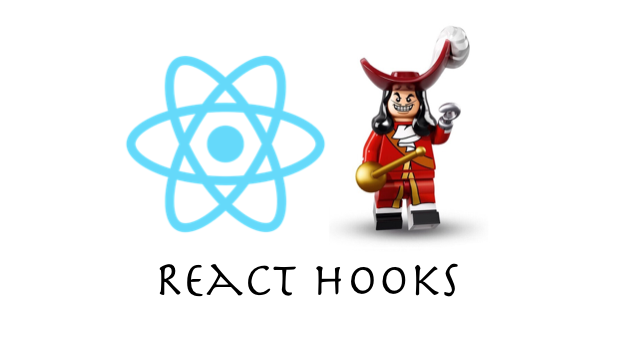

# React-Hooks-Tutorial

> velopert님의 https://velog.io/@velopert/react-hooks를 참고하여 공부한 repo이다.



## What is Hooks?

`Hooks`는 React `v16.8`에 도입된 기능으로써, 함수형 컴포넌트에서도 `상태 관리`를 할 수 있는 `useState`, 렌더링 직후 작업을 설정하는 `useEffect` 등의 기능등을 제공하여 기존의 함수형 컴포넌트에서 할 수 없었던 다양한 작업을 할 수 있게 한다.

## useState

가장 기본적인 `Hooks`로써 함수형 컴포넌트에서도 `가변`적인 `state`를 지니고 있을 수 있게 해준다. <br />
만약 함수형 컴포넌트에서 `state`를 관리해야한다면 이 `Hooks`를 사용하면 된다.

```js
const [value, setValue] = useState(0);
```

위와 같은 `비구조화 할당` 형식으로 값이 할당되는데 배열의 **첫번째 원소**는 `상태값`이고 **두번째 원소** 는 상태를 `설정`하는 함수이다.

## useEffect

**React Component**가 **rendering** 될 때마다 특정 작업을 수행할 수 있도록 설정할 수 있는 `Hooks`이다. 이 `Hooks`는 **class Component**의 `componentDidMount`와 `componentDidUpdate`를 합친 형태와 비슷하다.

```js
import React, {useState, useEffect} from 'react';
(...)

useEffect(() => {
  console.log('effect!');
});

```

### Mount할때만 실행

useEffect에서 처음 렌더링 될때만 실행되고 update할 경우에 실행할 필요가 없는 경우에는 함수의 두번째 인수로 비어있는 배열을 넣어주면 된다.

```js
useEffect(() => {
  console.log("마운트 될때만 실행!");
}, []);
```

`component`가 처음 나타날 때만 `console`에 문구가 나타나고 그 이후에는 나타나지 않는다.

### 특정 값이 update 될 때만 실행

- Class component

```js
componentDidMount(prevProps, prevState){
  if(prevProps.value !== this.prevState){
    //code
  }
}
```

위 코드는 `props`안에 들어있는 `value`값이 바뀔 때만 특정 작업을 수행한다. <br />
`useEffect`에서 구현한다면 **두번째 인수**로 전달되는 배열안에 검사하고 싶은 값을 넣어주면 된다. <br />

- useEffect

```js
useEffect(() => {
  console.log(value);
}, [value]);
```

이 배열안에는 `useState`를 통해 관리하고 있는 `state`를 넣어줘도 되고 `props`로 전달받은 값을 넣어줘도 된다.

### cleanup

`useEffect`는 기본적으로 렌더링 된 직후마다 실행되며, 두번째 인수로 배열에 무엇을 넣느냐에 따라 조건이 달라진다. <br />
만약 `component`가 `unmount`되기 전이나 `update` 직전에 어떠한 작업을 수행하고 싶다면 `useEffect`에서 `cleanup` 함수를 반환하면 된다. <br />

```js
useEffect(() => {
  console.log("effect");
  return () => {
    console.log("cleanup");
  };
});
```

뒷정리 함수가 호출 될 때에는 `update` 되기 직전의 값을 보여준다. <br />
오직 `unmount` 될 때만 뒷정리 함수를 호출하고 싶으면 `useEffect` 함수의 두번째 인수에 비어있는 배열을 넣어주면 된다.

```js
useEffect(() => {
  console.log("effect");
  return () => {
    console.log("cleanup");
  };
}, []);
```

## UseContext

이 `Hooks`를 사용하면 **functional component**에서 `Context`를 보다 쉽게 사용 할 수 있다.

```js
import React, { useSteate, useContext } from 'react';

const ThemeContext = createContext('black');

const test = () => {
  const theme = useContext(ThemeContext);
  const style = {
    background : theme
  }
  (..)
};
```
